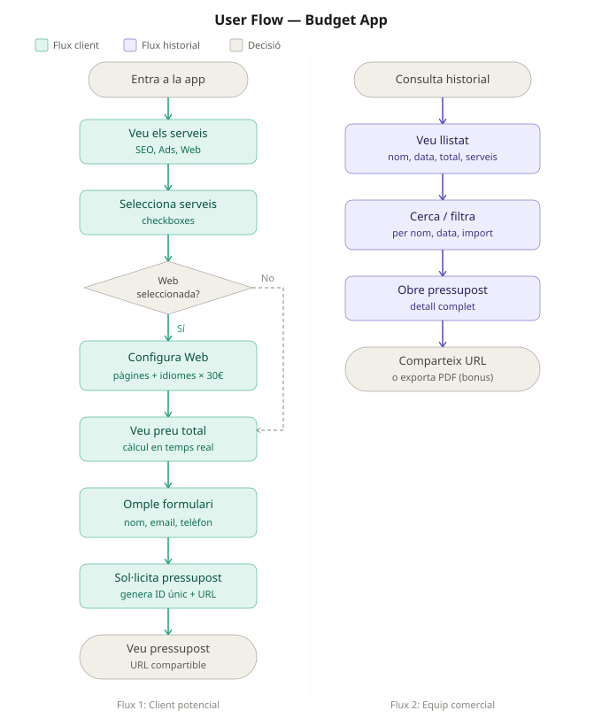
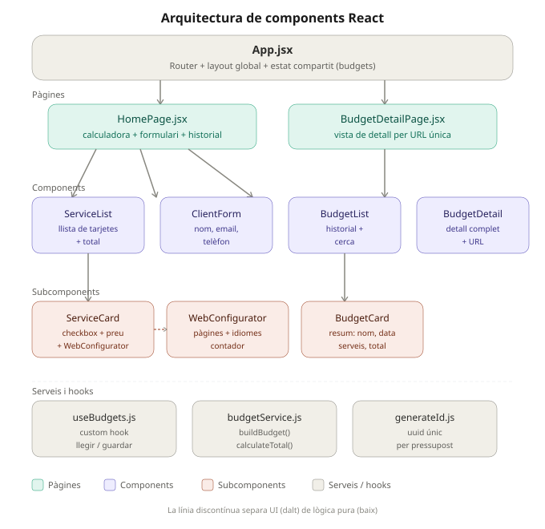
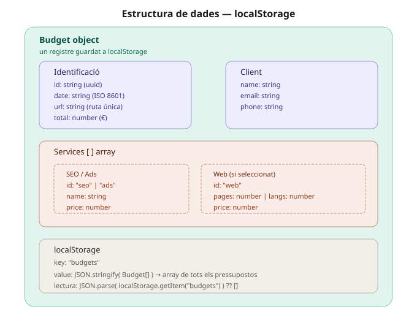
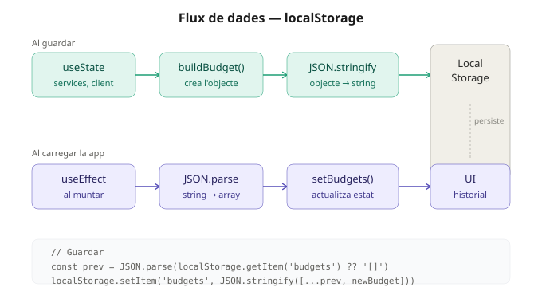
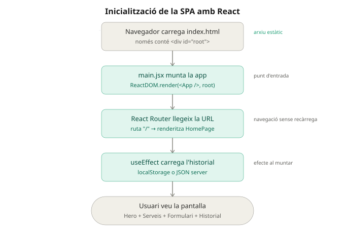

# IT Budget App

Aplicación web para generar y gestionar presupuestos de servicios digitales, desarrollada con React 19 y TypeScript como parte del Sprint 4 del curso Frontend de IT Academy.

🔗 **Demo en vivo:** [https://itbudgetapp.netlify.app/](https://itbudgetapp.netlify.app/)

---

## Funcionalidades

- Selección de servicios digitales: SEO, Ads y Web
- Configurador de páginas e idiomas para el servicio Web (precio dinámico)
- Cálculo del total en tiempo real
- Formulario de datos del cliente
- Lista de presupuestos guardados con búsqueda por nombre y ordenación por fecha, importe y nombre
- Página de detalle por presupuesto
- Descarga del presupuesto en formato PDF
- Compartir presupuesto por URL
- Eliminar presupuesto con modal de confirmación
- Persistencia de datos en `localStorage`

---

## Tecnologías

| Herramienta | Uso |
|---|---|
| React 19 | Librería de UI |
| TypeScript | Tipado estático |
| React Router v7 | Navegación client-side |
| Vite | Bundler y servidor de desarrollo |
| jsPDF | Generación de PDFs en el navegador |
| nanoid | Generación de IDs únicos |
| Jest + ts-jest | Framework de testing |

---

## Estructura del proyecto

```
src/
├── components/       # Componentes reutilizables de UI
│   ├── ServiceCard.tsx
│   ├── ServiceList.tsx
│   ├── WebConfigurator.tsx
│   ├── ClientForm.tsx
│   ├── BudgetCard.tsx
│   ├── BudgetList.tsx
│   └── BudgetDetail.tsx
├── pages/            # Componentes ligados a rutas
│   ├── HomePage.tsx
│   └── BudgetDetailPage.tsx
├── hooks/            # Lógica React reutilizable
│   └── useBudgets.ts
├── services/         # Lógica pura sin React
│   ├── budgetService.ts
│   └── validateClient.ts
├── types/            # Definiciones de tipos TypeScript
│   └── budget.types.ts
├── __tests__/        # Tests unitarios
│   ├── budgetService.test.ts
│   ├── useBudgets.test.ts
│   └── validateClient.test.ts
├── __mocks__/        # Mocks para testing
│   └── nanoid.ts
└── index.css
```

---

## Diagramas

### User Flow


### Arquitectura de componentes


### Estructura de datos


### Flux localStorage


### Inicialización SPA


---

## Arquitectura y decisiones técnicas

**Flujo de datos:** los datos fluyen hacia abajo mediante props y los eventos hacia arriba mediante callbacks (patrón *lifting state up*).

**Estado:** el estado de los presupuestos vive en el hook `useBudgets`, que centraliza la lógica de lectura, escritura y persistencia en `localStorage`.

**Tipado:** se definen tres interfaces principales — `Service`, `Client` y `Budget` — que garantizan consistencia en toda la aplicación.

**Cálculo de precios:** la función `calculateTotal` en `budgetService.ts` es lógica pura, sin dependencias de React, fácilmente testeable.

---

## Tests

El proyecto incluye **24 tests unitarios** organizados en 3 suites, escritos con **Jest + ts-jest** siguiendo la metodología **BDD** con escenarios en formato **Gherkin** (Given / When / Then).

### Ejecutar los tests

```bash
# Ejecutar todos los tests
npm test

# Ejecutar con informe de cobertura
npm run test:coverage
```

### Suites de tests

| Archivo | Función testada | Tests |
|---|---|---|
| `budgetService.test.ts` | `calculateTotal`, `buildBudget` | 11 |
| `useBudgets.test.ts` | Persistencia en `localStorage` | 6 |
| `validateClient.test.ts` | `validateClient` | 7 |

### Enfoque BDD — Gherkin

Cada test documenta el comportamiento esperado con comentarios Given / When / Then antes del código:

```ts
// Scenario: Web con 3 páginas y 2 idiomas
// Given el usuario selecciona Web con 3 páginas y 2 idiomas
// When se calcula el total
// Then el resultado debe ser 650 (500 + (3+2)*30)
it('devuelve 650 para Web con 3 páginas y 2 idiomas', () => {
  expect(calculateTotal([WEB_3_2])).toBe(650)
})
```

### Decisiones de diseño

- **Lógica pura extraída:** `validateClient` se extrajo de `ClientForm.tsx` a `services/validateClient.ts` para poder testarla sin dependencias de React.
- **Mock de nanoid:** `nanoid` genera IDs aleatorios en producción. En los tests se sustituye por un mock determinista (`mock-id-1`, `mock-id-2`...) para que los resultados sean predecibles.
- **Mock de localStorage:** `localStorage` no existe en el entorno Node.js de Jest. Se simula con un objeto en memoria que replica la API (`getItem`, `setItem`, `clear`).

---

## Instalación y uso local

```bash
# Clonar el repositorio
git clone https://github.com/narowe/it-budget-app.git
cd it-budget-app

# Instalar dependencias
npm install

# Iniciar servidor de desarrollo
npm run dev

# Build de producción
npm run build
```

---

## Flujo de trabajo Git

El proyecto sigue un modelo **Git Flow simplificado**:

- `main` — código de producción, solo recibe merges desde `develop`
- `develop` — rama de integración, recibe merges de las feature branches
- `feat/*` — una rama por funcionalidad

### Ramas del proyecto

| Rama | Contenido |
|---|---|
| `feat/project-structure` | Estructura de carpetas, tipos TypeScript, configuración de React Router |
| `feat/service-selector` | ServiceCard, ServiceList, lógica de cálculo de precios |
| `feat/client-form` | ClientForm con inputs controlados |
| `feat/budget-saving` | Hook useBudgets, BudgetCard, BudgetList, persistencia localStorage |
| `feat/budget-detail` | BudgetDetailPage, BudgetDetail, formateo de fechas |
| `feat/styles` | CSS completo, diseño responsive |
